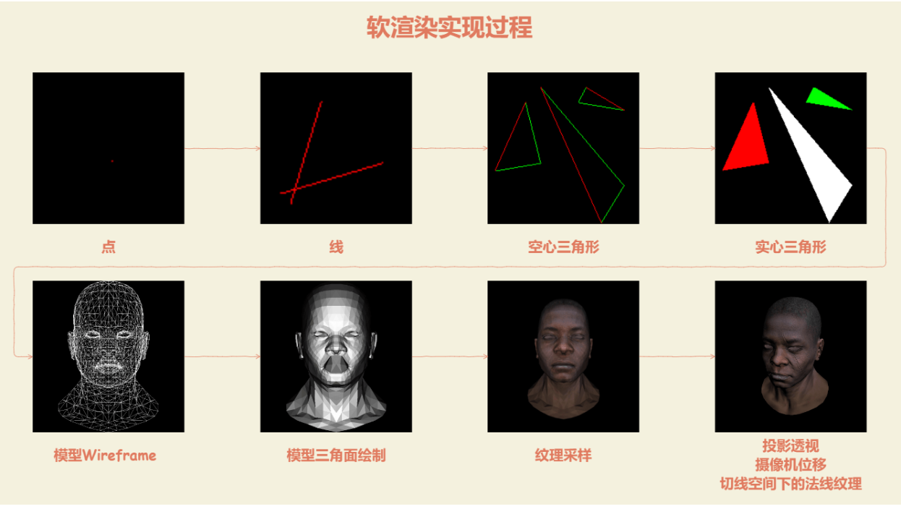
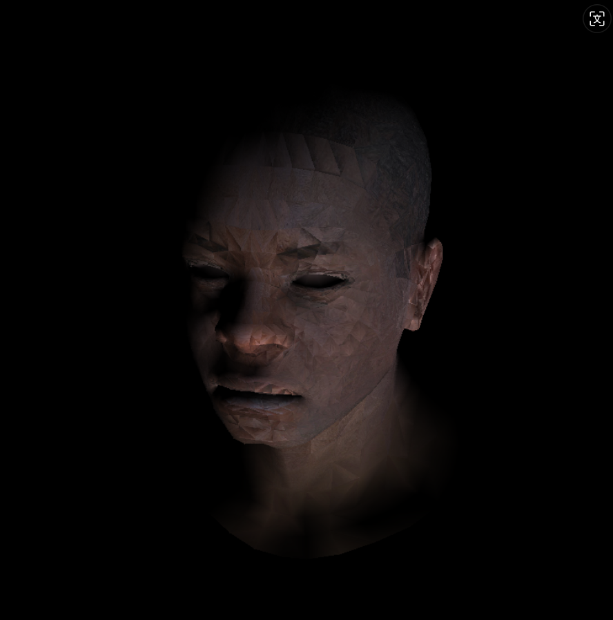
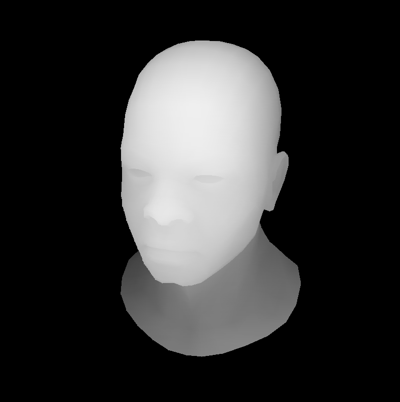
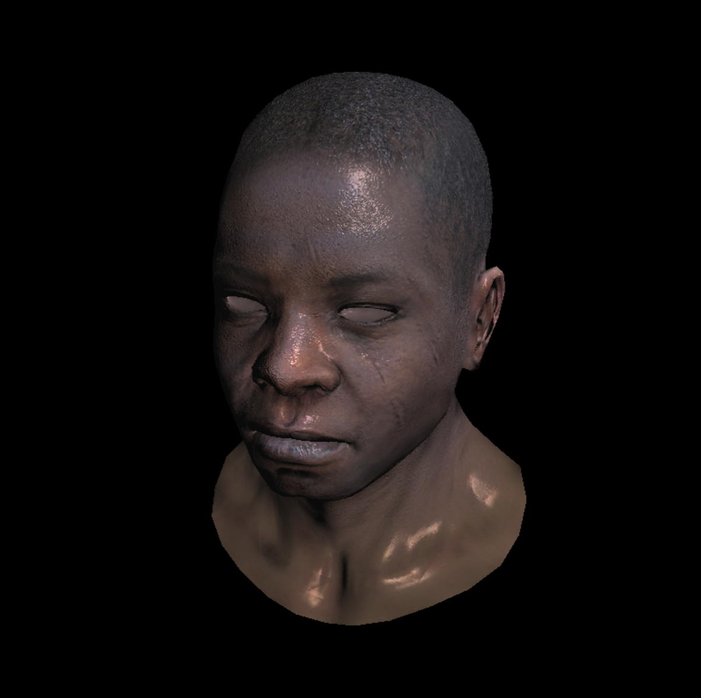

# my-renderer

## 0. 项目简介

此项目为加深对于 OpenGL 等图形学 API 底层渲染理解。这是一个由 C++实现的仿 openGL 的**零依赖软渲染器**，零依赖代表项目不依赖任何第三方库，软渲染代表所有的计算都是在 CPU 侧进行。

项目开发环境：Windows 11 + VSCode + MinGW-w64 + CMake（Windows 11 配置 MinGW-w64 见文档末尾）

## 1. 项目特征

- [x] Bresenham 画线算法：利用画点 API，采用 Bresenham 画线算法，画出直线
- [x] Wireframe-drawing：实现 OBJ 模型数据读取，画出模型线框
- [x] Trangile-drawing：利用画线 API，利用线性插值因子，实现画实心三角形
- [x] Lambertian 漫反射：实现 Lambertian 漫反射用于光照计算
- [x] Backface culling：根据数据画出模型三角形面，并剔除背面三角形
- [x] Z-buffer：计算像素深度缓冲, 实现 Z-testing
- [x] Barycentric: 质心计算, 用于后续实现三角形内光照，纹理插值等
- [x] Perspective projection：透视投影，实现模型的透视投影
- [x] Texture-mapping：实现模型的纹理映射
- [x] Flat Shading：实现模型的 Flat shading
- [x] Gouraud shading：实现模型的 Gouraud shading
- [x] Glulookat：实现模型的 MV 矩阵变换
- [x] Phong shading：单独封装顶点着色器和片元着色器，利用法线、漫反射、高光贴图实现模型的 Phong shading
- [x] Tangent space normal mapping: 实现切线空间下的法线映射
- [ ] Shadow mapping: 实现阴影映射

## 2. 项目架构

### include

- `geometry.h`: 声明几何图形的相关数据结构和操作，例如顶点、边、面等。
- `model.h`: 定义 3D 模型的相关接口和操作方法，用于加载、保存和处理模型数据。
- `tgaimage.h`: 用于处理 TGA 格式图像的头文件，提供加载和处理 TGA 文件的功能。

### obj

- `african_head_diffuse.tga`: 非洲人头像模型的漫反射贴图，用于提供基础颜色信息。
- `african_head_nm.tga`: 法线贴图，提供模型表面的法线信息，增强光照效果。
- `african_head_read_me.txt`: 说明文件，包含模型使用的详细信息。
- `african_head_spec.tga`: 高光贴图，定义模型表面反射高光的区域。
- `african_head_SSS.jpg`: 次表面散射（SSS）纹理，模仿光线穿透表面的散射效果。
- `african_head.obj`: 非洲人头像的 3D 模型文件，包含几何数据。

### output

项目的输出文件目录，通常存放编译后的可执行文件和其他生成的资源。

### src

- `geometry.cpp`: 实现几何体的相关操作，如顶点、边、面的计算和转换。
- `main.cpp`: 项目的入口文件，可能包含初始化、渲染循环和主要逻辑的实现。
- `model.cpp`: 实现 3D 模型的加载、处理和渲染功能，通常与 `.obj` 文件配合使用。
- `tgaimage.cpp`: 实现 TGA 格式图像的加载和处理功能，用于纹理映射。

### test

- `backface_culling.cpp`: 实现背面剔除算法，渲染时忽略看不见的多边形面，提高渲染效率。
- `barycentric.cpp`: 实现重心坐标算法，通常用于光栅化三角形和着色计算。
- `draw_lines.cpp`: 用于绘制线段的算法或功能，可能用于渲染边框或辅助图形。
- `draw_triangles.cpp`: 实现三角形的光栅化或绘制功能，常用于 3D 渲染。
- `glLookAt_GouraudShading.cpp`: 实现摄像机视角（LookAt 矩阵）和 Gouraud 着色（基于顶点的光照插值着色）功能。
- `perspective_projection.cpp`: 实现透视投影变换，将 3D 场景投射到 2D 屏幕上。
- `wireframe_rendering.cpp`: 实现线框渲染模式，渲染模型时仅显示其边框而不填充。

## 3. 项目 Pipline



## 4. 项目效果

<!--  -->

<!--  -->



## 5. 构建与运行

本项目使用 Windows 下使用 VSCode + MinGW-w64 + CMake 开发

要构建本项目，请在**项目的根目录**中运行以下命令，项目会自动进行构建，并将 bulid 文件放在根目录下面：

```C++
cmake -B build
```

接下来，运行以下命令以编译项目：

```C++
cmake --build build --config Release
```

要运行项目，请在项目的根目录中运行以下命令：

```C++
./output/main.exe
```

## 6. 参考

[在 Windows 下利用 VScode 从零配置 MinGW-w64](https://zhuanlan.zhihu.com/p/610895870)

[tinyrenderer](https://github.com/ssloy/tinyrenderer/wiki/)

[Hana-SoftwareRenderer](https://github.com/DrFlower/Hana-SoftwareRenderer)

[GAMES101-现代计算机图形学入门-闫令琪](https://www.bilibili.com/video/BV1X7411F744)

[《Unity Shader 入门精要》](https://candycat1992.github.io/unity_shaders_book)
